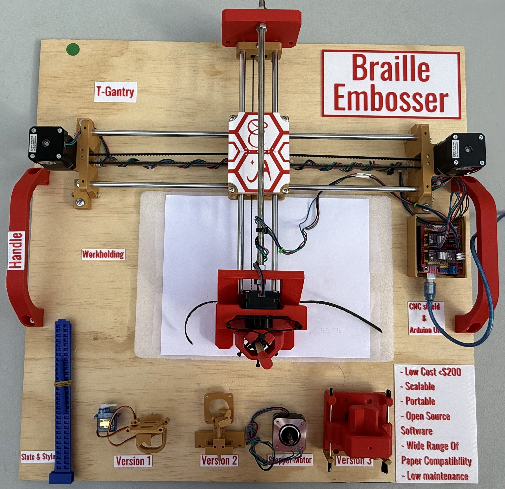

# LowCostBrailleEmbosser
Low Cost Braille Embosser

In 2024 summer, I bought a 3D printer for a robotics competition. Fascinating by how it works, my friend Andrew and I researched more about it Youtube. When viewing videos that were related to mechanics, the CNC machinery and CNC plotters inspired us with a bright solution to another science video we watched associated to low vision society life challenges. We studied the CNC plotter from Henry Arnold and Jonathan K and started our project from here. Another learning example is how to convert text to braille SVG vector format. We studied Zwettekop’s open source code (https://github.com/Zwettekop) as an example and worked out a converter for our Braille embosser. 

The project is presented in GSDSEF March 2025, and CSEF April 2025. 

3DPrintFiles folder documented the 3D printable part that can be installed on top of the CNC plotter based on Henry Arnold and Jonathan K. 

BrailleToSVG-main folder shows the Braille to SVG example that we studied Zwettekop’s open source code as an example and worked out a converter for our Braille embosser. 

Images folder has the Braille Embosser image. 
